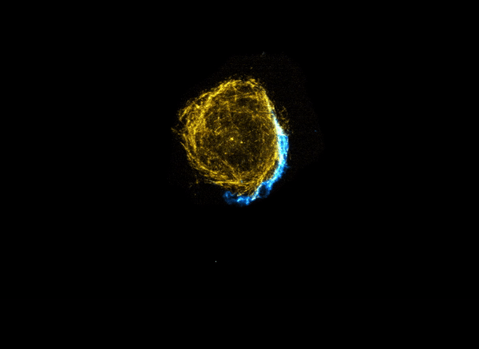

# Chimera Ubuntu boot splash theme

Animated [Plymouth][plymouth] theme with the animation of a microscope cell video.

Adapted from [Vortex-ubuntu](https://github.com/emanuele-scarsella/vortex-ubuntu-plymouth-theme) theme

Disk encryption password prompt is supported.

## Demo

### Animated demo



## Installation

To preview the theme interactively, install the `plymouth-x11` package:

```shell
sudo apt install plymouth-x11
```

To install the theme and set it as the default, navigate to the repository
directory:

```shell
cd path/to/chimera-ubuntu-plymouth-theme
```
Make the "install" file executable:
```shell
sudo chmod +x install
```
execute the `install` file with `sudo`.

```shell
sudo ./install
```

## Preview / Testing

To preview the currently active Plymouth theme, navigate to the repository
directory:

```shell
cd path/to/chimera-ubuntu-plymouth-theme
```
make the 'show-splash.sh' file executable

```shell
sudo chmod +x show-splash.sh
```
execute the 'show-splash.sh' file
```shell
sudo ./show-splash.sh
```


## Removal

To remove the theme, navigate to the repository
directory and invoke the `install` script with the `uninstall` argument:

```shell
cd path/to/chimera-ubuntu-plymouth-theme
```

Make the "uninstall" file executable:
```shell
sudo chmod +x uninstall
```
execute the `uninstall` file with `sudo`.

```shell
sudo ./uninstall
```

The uninstallation process will prompt you to set a new theme. The default
Plymouth theme in Ubuntu 22.04 is `bgrt`.

# Customization

## Background color

Modify `chimera-ubuntu/bg.png` in the repository, and fill the image with your
desired background color. After modification, reinstall the theme with
`./install` as described above.

## Background image

Replace `chimera-ubuntu/bg.png` in the repository with your desired background
image. Your image must be in PNG format. After modification, reinstall the theme
with `./install` as described above.

## License

This project is licensed under the GNU General Public License (GPL) version 2.
See [`LICENSE`][license] for more information.

## Acknowledgments

[Vortex-ubuntu](https://github.com/emanuele-scarsella/vortex-ubuntu-plymouth-theme) theme


[license]: /LICENSE
[plymouth]: https://freedesktop.org/wiki/Software/Plymouth/
